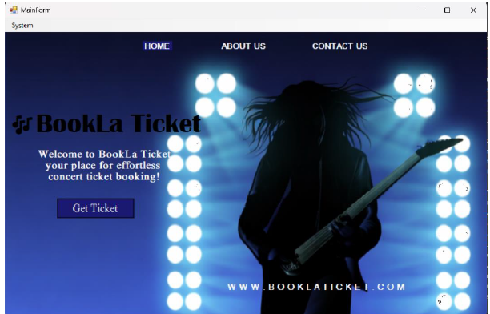
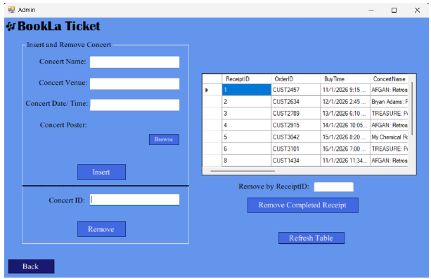
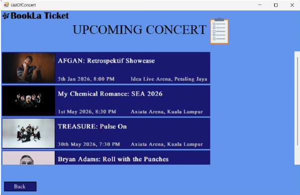
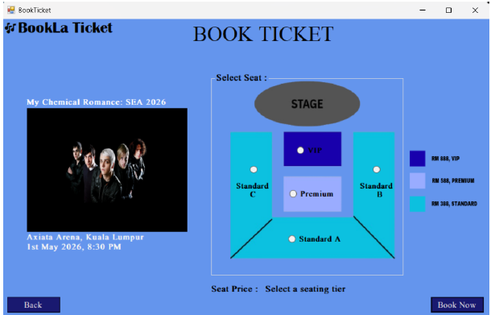
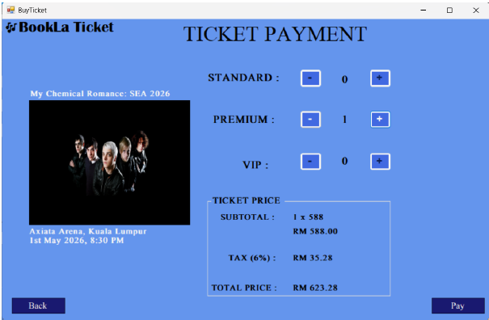
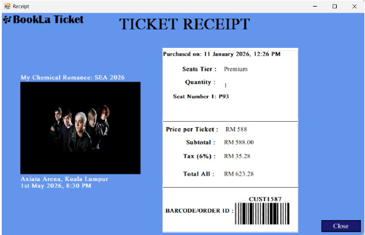

# BookLa Ticketing Concert System 🎟️

## 📌 Overview
A VB.NET Windows Form application for concert ticket booking.  
Built as part of CSC301 Visual Programming coursework.

## 🚀 Features
- Secure Admin Login (SQL parameter mapping)
- CRUD operations for concert list
- Dynamic event feed layout
- Multi-form ticket booking
- Pricing pipeline with tax
- Database persistence & receipt generation

## 🛠️ Tech Stack
- VB.NET (Visual Studio 2017)
- MySQL Database

## ▶️ How to Run
1. Clone this repository.
2. Open `Ticketing App Draft.sln` in Visual Studio.
3. Build and run the project.
4. Use Admin login to manage concerts.

## 📸 Screenshots
### Main Form

### Admin Form

### Concert List

### Book Ticket

### Buy Ticket

### Receipt

## 👩‍💻 My Role
- Designed database ERD & login system
- Implemented CRUD pipeline for concerts
- Built dynamic seat allocation & pricing logic
- Integrated receipt saving into MySQL
